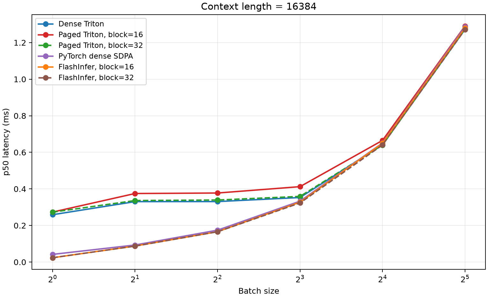
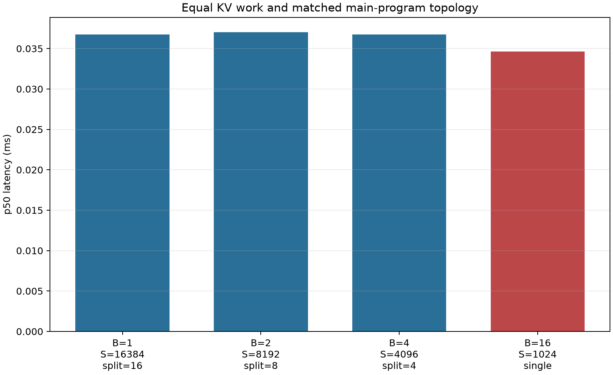
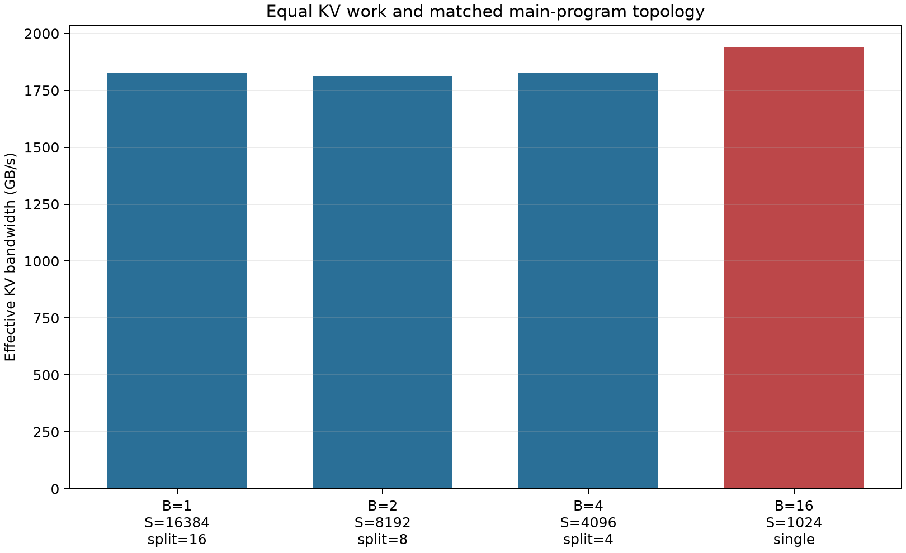
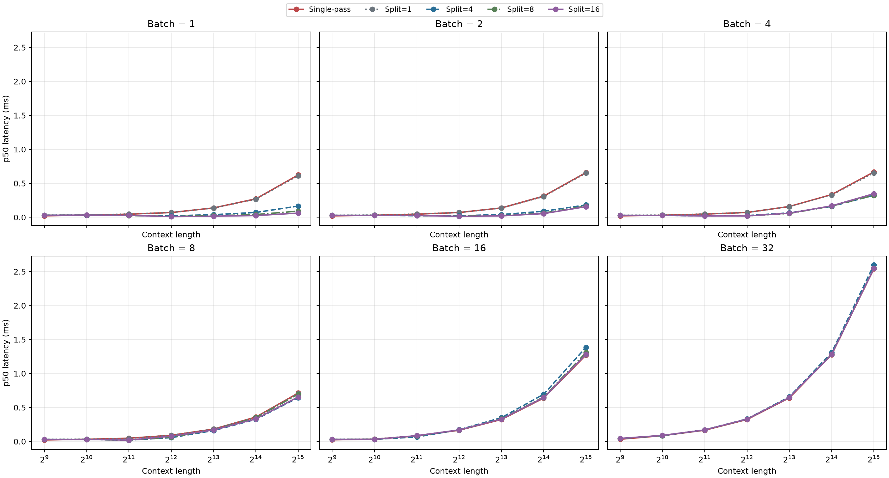
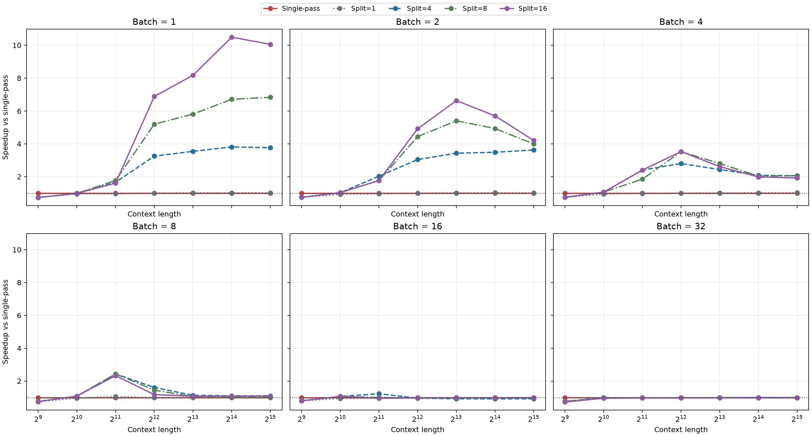
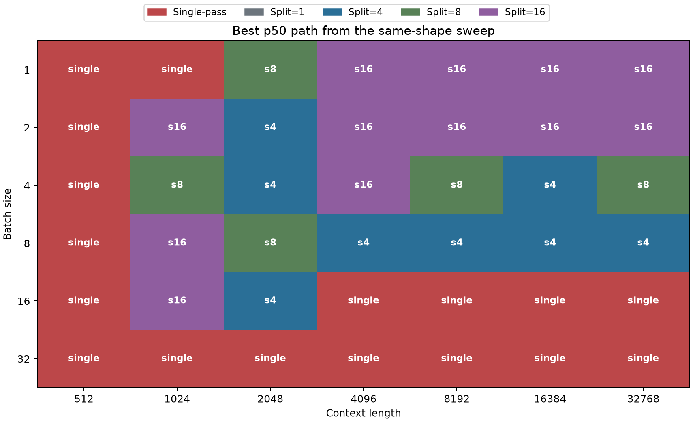
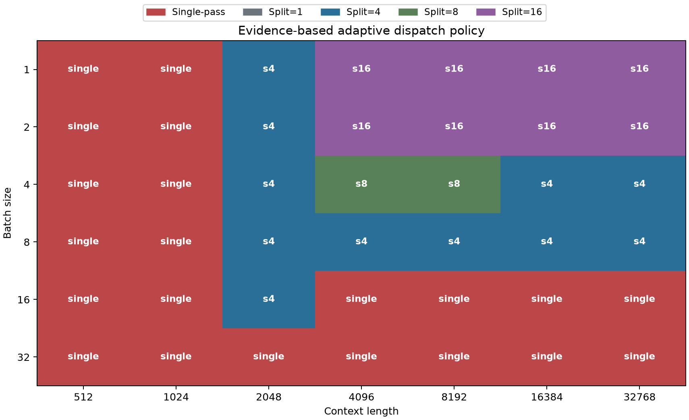
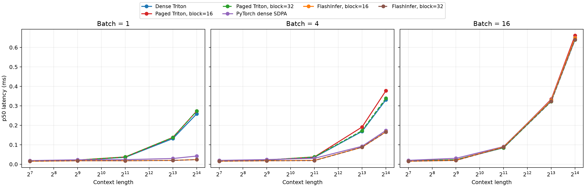
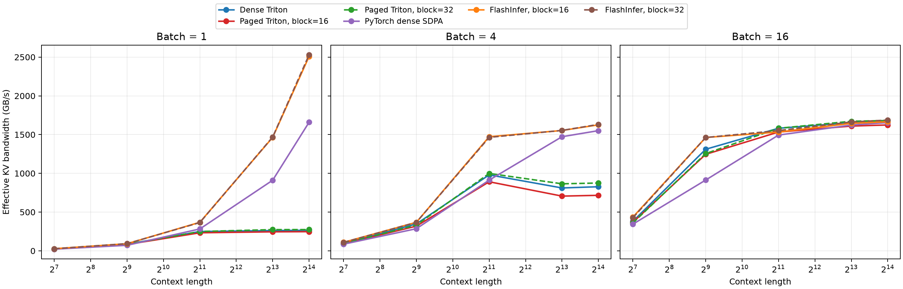
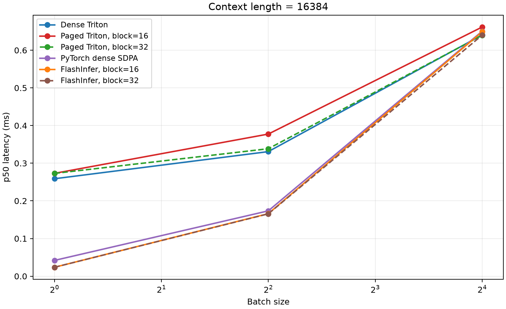

# Benchmark Results

## Status

当前 canonical results（标准结果）位于：

```text
benchmarks/results/decode_attention_flashinfer.csv
benchmarks/results/decode_attention_program_saturation.csv
benchmarks/results/split_kv_equal_work.csv
benchmarks/results/split_kv_same_shape.csv
```

主 sweep 使用 `batch=1/4/16`、`context=128/512/2048/8192/16384`、
`block_size=16/32`、`num_heads=8`、`head_dim=128`、FP16、`warmup=50`、
`repeat=300`。对照 sweep 包含 Dense Triton、Paged Triton、PyTorch SDPA 和
FlashInfer，共 90 行。

CSV 使用 `1792 GB/s` 作为 RTX 5090 nominal peak memory bandwidth（标称峰值显存带宽）假设，
同时记录 effective bandwidth 和 nominal utilization。该比例是解析模型，不是 NCU DRAM counter。

## Reproduction

先验证 correctness（正确性）：

```bash
bash scripts/run_tests.sh
uv run pytest -q tests/test_triton_decode.py
```

运行一个快速 smoke benchmark（冒烟基准测试）：

```bash
bash scripts/run_benchmarks.sh \
  --batches 1 \
  --contexts 128,512 \
  --block-sizes 16 \
  --warmup 5 \
  --repeat 20
```

运行不含 FlashInfer 的主 sweep：

```bash
bash scripts/run_benchmarks.sh \
  --batches 1,4,16 \
  --contexts 128,512,2048,8192,16384 \
  --block-sizes 16,32 \
  --warmup 50 \
  --repeat 300 \
  --peak-bandwidth-gbps 1792
```

运行 FlashInfer 对照 sweep：

```bash
uv sync --locked --group baseline
uv run --group baseline python scripts/run_benchmarks.py \
  --batches 1,4,16 \
  --contexts 128,512,2048,8192,16384 \
  --block-sizes 16,32 \
  --providers dense_triton,paged_triton,pytorch_dense_sdpa,flashinfer_paged \
  --warmup 50 \
  --repeat 300 \
  --peak-bandwidth-gbps 1792 \
  --output benchmarks/results/decode_attention_flashinfer.csv
```

从 CSV 生成静态图表：

```bash
uv sync --locked --group plot
uv run --group plot python scripts/plot_benchmarks.py benchmarks/results/<result>.csv
```

运行 program-matched equal-work analysis（程序结构匹配的等工作量分析）：

```bash
uv run python scripts/run_equal_work_benchmark.py \
  --total-context-tokens 16384 \
  --cases 1:16,2:8,4:4,16:single \
  --warmup 50 \
  --repeat 300 \
  --peak-bandwidth-gbps 1792 \
  --output benchmarks/results/split_kv_equal_work.csv

uv run --group plot python scripts/plot_benchmarks.py \
  benchmarks/results/split_kv_equal_work.csv
```

运行用于 dispatch 的 same-shape sweep：

```bash
uv run python scripts/run_split_kv_benchmarks.py \
  --batches 1,2,4,8,16,32 \
  --contexts 512,1024,2048,4096,8192,16384,32768 \
  --splits 1,4,8,16 \
  --warmup 50 \
  --repeat 300 \
  --peak-bandwidth-gbps 1792 \
  --output benchmarks/results/split_kv_same_shape.csv

uv run --group plot python scripts/plot_benchmarks.py \
  benchmarks/results/split_kv_same_shape.csv
```

## Measurement Contract

- Triton kernel 与 PyTorch dense SDPA 使用 CUDA events 计时。
- Python paged reference 使用 synchronized wall clock，包含 Python 循环和同步成本。
- Python paged reference 默认不加入主 sweep；显式选择后使用独立的较小 `--reference-repeat`。
- 输入生成、paged cache packing、correctness guard 和 Triton JIT 不在计时区内。
- FlashInfer 的 page metadata、`plan()` 与 JIT 不在计时区内；CUDA events 覆盖一次
  `wrapper.run(..., out=preallocated)` 发起的全部 GPU kernels。
- 项目 Triton kernel 按当前 contract 写 FP32 output，PyTorch SDPA 与 FlashInfer 写 FP16
  output。最终 output 远小于长 context K/V 读取量，因此主要趋势仍可比较，但不是完全相同的
  output dtype contract。
- CSV 是 source of truth（唯一数据源），图表只从 CSV 生成。
- 当前 clock state 为 `recorded_not_locked`，每行记录运行时 graphics/memory clock。
- benchmark 重复读取同一组 K/V。工作集可进入 L2 时，解析 effective bandwidth 可能超过标称
  DRAM peak；此时该指标表示“逻辑 KV bytes / latency”，不能当作 NCU DRAM counter。
- same-shape sweep 保持实际 workload 的 `B/S` 不变，用于决定 single/split dispatch；equal-work
  analysis 改变 `B/S` 但固定 `B*S` 与 program topology，只用于解释性能机制，不能替代线上延迟
  对比。

## Initial Hypotheses

- 长 context 下延迟主要受 K/V memory traffic（内存流量）约束。
- `batch=1` 时只有 `num_heads` 个 Triton programs，长 context 顺序扫描可能导致 occupancy 不足。
- 增加 batch 后并行 program 数增加，有效带宽应先提高，再逐渐饱和。
- Paged Triton 相对 dense Triton 会承担 block-table lookup 和更离散的内存访问成本。

这些是假设，不是结论。正式图表生成后再逐项接受或否定。

## Single-Pass Results

长 context 的 p50 latency（ms）：

| Batch | Context | Dense Triton | Paged Triton 16 | Paged Triton 32 | Dense SDPA |
| ---: | ---: | ---: | ---: | ---: | ---: |
| 1 | 16384 | 0.2588 | 0.2731 | 0.2729 | 0.0419 |
| 4 | 16384 | 0.3308 | 0.3774 | 0.3385 | 0.1735 |
| 16 | 16384 | 0.6406 | 0.6616 | 0.6396 | 0.6504 |

`context=16384` 时，Paged Triton 的 effective bandwidth 从 `batch=1` 的约
`246 GB/s`（约标称峰值的 `14%`）提升到 `batch=16` 的约
`1679 GB/s`（约 `94%`）。同一 kernel 随着
`(batch, head)` programs 增加获得约 6 倍有效带宽，支持“小 batch 下 program 数不足、
GPU 未被充分利用”的假设。

Paged Triton 相对 Dense Triton 的长 context 开销并不恒定：

- `block=16` 时，`batch=1/4/16` 分别约慢 `5.5% / 14.1% / 3.3%`；
- `block=32` 时，`batch=1/4/16` 分别约慢 `5.4% / 2.3% / -0.2%`；
- 这不是“分页天然更快”，而是 block size、访存状态和 kernel 配置共同作用的结果。

这说明 paging overhead（分页开销）会与并行度、block size 和内存访问状态共同作用，不能用
单个固定百分比概括。

## Program Saturation

固定 `context=16384`、`H=8` 后，Paged Triton block-32 的 program saturation 结果为：

| Batch | Programs (`B*H`) | Effective bandwidth | Nominal utilization |
| ---: | ---: | ---: | ---: |
| 1 | 8 | 246 GB/s | 13.7% |
| 2 | 16 | 399 GB/s | 22.3% |
| 4 | 32 | 791 GB/s | 44.1% |
| 8 | 64 | 1495 GB/s | 83.4% |
| 16 | 128 | 1679 GB/s | 93.7% |
| 32 | 256 | 1685 GB/s | 94.0% |

所有行来自同一个 canonical sweep；每个值是单轮 300 个 CUDA-event samples 的
p50 latency 所推导的 effective bandwidth。它不是跨运行置信区间。跨运行稳定性应另行重复
完整 sweep，再报告 `median(run_p50)` 和 `min-max`。

`128 -> 256` programs 后工作量与延迟近似同时翻倍，而带宽几乎不再提升，因此 split-KV 的
首批候选应为 `split=4/8/16`，不默认使用 `split=32`。



## Equal-Work Split-KV Analysis

same-shape benchmark 回答“给定真实 `B/S` 应选择哪个实现”，但不能直接解释不同 batch 间的
归一化效率。为隔离 program topology（程序拓扑）和 split/reduce 成本，equal-work sweep 固定：

```text
B * S                  = 16384
analytical KV bytes    = 64 MiB
main programs          = 128
tokens / main program  = 1024
```

四个 case 共享同一块随机顺序 K/V storage。每个 measurement cycle（测量周期）将四个 case
确定性随机排序并各测一次，以平衡动态时钟、热缓存和固定测量顺序的影响。输入与 buffer 分配、
FP32 dense-reference correctness guard 和 Triton JIT 均排除在 CUDA-event 计时区间外。
RTX 5090 上的正式结果为：

| Batch | Context | Implementation | Main programs | Reduce programs | Partial bytes | p50 | p95 |
| ---: | ---: | --- | ---: | ---: | ---: | ---: | ---: |
| 1 | 16384 | split=16 | 128 | 8 | 65 KiB | 0.0368 ms | 0.0411 ms |
| 2 | 8192 | split=8 | 128 | 16 | 65 KiB | 0.0370 ms | 0.0412 ms |
| 4 | 4096 | split=4 | 128 | 32 | 65 KiB | 0.0367 ms | 0.0426 ms |
| 16 | 1024 | single | 128 | 0 | 0 | 0.0346 ms | 0.0379 ms |

三个 split case 的 p50 基本相同。固定 `B*split` 后，它们不只读取相同 KV bytes，也产生相同数量
的 main programs、partial states 和总 reduce 输入。`B=16,S=1024` single-pass 在相同主工作量
下当前约快 `1.06x`，量化了 split 路径 materialize partial `m/l/acc`、第二次 kernel launch
与 reduce 的合计成本。这个差距较小，锁定为稳定结论前仍需重复完整 run 并报告跨 run 范围。

该 sweep 使用 shared-KV interleaved steady state（共享 KV 的交错稳态）；64 MiB useful KV
working set 可被 L2 复用，因此 effective bandwidth 可能超过 nominal DRAM peak。这里应比较
同一 run 内的相对延迟，不能把解析带宽解释为实际 DRAM transaction rate。





## Same-Shape Split-KV And Adaptive Dispatch

正式 sweep 覆盖 `B=1/2/4/8/16/32`、`S=512..32768`、single-pass 与
`split=1/4/8/16`，共 42 个 shape、210 行。每个 shape 共用同一组随机顺序 paged K/V，五种实现
按确定性随机顺序交错测量；计时前所有 split 输出先与 single-pass 对齐。该 sweep 保持真实数据量
不变，因此可以直接回答“这个 `(B,S)` 应选哪条路径”。

令 `P = batch_size * num_heads`，当前 adaptive policy 按下表从上到下匹配：

| 条件 | 选择 |
| --- | --- |
| `block_size != 32`、`S <= 1024` 或 `P >= 256` | single |
| `128 <= P < 256` | `S=2048` 用 split=4，其他用 single |
| `64 <= P < 128` | split=4 |
| `32 <= P < 64` | `S<=2048` 用 split=4，`S<=8192` 用 split=8，更长用 split=4 |
| `P < 32` | `S<=2048` 用 split=4，更长用 split=16 |

`S=16384` 的关键结果如下：

| Batch | Adaptive path | p50 | Speedup vs single |
| ---: | --- | ---: | ---: |
| 1 | split=16 | 0.0259 ms | 10.50x |
| 2 | split=16 | 0.0548 ms | 5.70x |
| 4 | split=4 | 0.1610 ms | 2.08x |
| 8 | split=4 | 0.3253 ms | 1.10x |
| 16 | single | 0.6385 ms | 1.00x |
| 32 | single | 1.2765 ms | 1.00x |

canonical CSV 记录的 42 个 adaptive choice 相对 single-pass 均未回退，最小 speedup 为 `1.00x`。
`B=16,S=2048` 仍可由 split=4 获得 `1.23x`，但 `B>=16,S>=4096` 保留 single；这与大 batch
进入带宽平台的 profiling evidence 一致。policy 相对每个 shape 的单轮逐点最优最大损失为
`1.087x`，发生在 `B=8,S=1024`：这里选择保守的 single，避免用微秒级、跨 run 易波动的短
context 差异扩大 dispatch 范围。

这是针对 RTX 5090、FP16、`H=8`、`D=128`、`block_size=32`、equal-length shape 校准的静态
policy，不是跨 GPU autotuner。其他 block size 直接回退 single；variable-length batch 使用
`max(context_lens)` 选择路径，目前只验证 correctness，尚未形成独立性能结论。









## FlashInfer Results

正式对照环境：RTX 5090、PyTorch `2.13.0+cu130`、Triton `3.7.1`、FlashInfer `0.6.14`。
长 context 的 block-32 p50 latency：

| Batch | Context | Paged Triton | FlashInfer | PyTorch SDPA | FlashInfer speedup vs Paged |
| ---: | ---: | ---: | ---: | ---: | ---: |
| 1 | 8192 | 0.1378 ms | 0.0195 ms | 0.0293 ms | 7.07x |
| 1 | 16384 | 0.2729 ms | 0.0237 ms | 0.0419 ms | 11.53x |
| 4 | 8192 | 0.1722 ms | 0.0871 ms | 0.0921 ms | 1.98x |
| 4 | 16384 | 0.3385 ms | 0.1656 ms | 0.1735 ms | 2.04x |
| 16 | 8192 | 0.3222 ms | 0.3236 ms | 0.3315 ms | 1.00x |
| 16 | 16384 | 0.6396 ms | 0.6400 ms | 0.6504 ms | 1.00x |

结论：FlashInfer 在 `B=1/4` 时通过 context parallelism 明显改善小 program-count 问题；到
`B=16`，single-pass Paged Triton、FlashInfer 与 SDPA 均收敛到约 `1.6-1.7 TB/s` 的解析有效
带宽。该结果为 Triton split-KV 提供了直接的定量目标，同时说明 adaptive dispatch 必须保护
已经带宽饱和的大 batch。

`B=1,S=16384` 的 FlashInfer 解析有效带宽约 `2.83 TB/s`，高于 `1792 GB/s` 标称 DRAM
peak。原因是 64 MiB 左右的逻辑 K/V 工作集可被反复 benchmark 的 L2 cache 复用；这不是显存
物理带宽超过硬件规格，也不能与冷缓存生产流量等同。







## Baseline Status

PyTorch paged reference 仅做教学下界：`B=1,S=128,H=8,block=16` 的 3 次 synchronized
wall-clock smoke 得到 `p50=1.878 ms`。它包含 Python token loop、`.item()` 与同步，不与 raw
GPU kernel 做生产级公平比较；3 个样本也不足以解释 p95。原始行位于
`benchmarks/results/pytorch_paged_reference_smoke.csv`。

FlashInfer `0.6.14` 已完成 multi-batch、随机 block table 和 partial tail page
correctness smoke：

```text
GPU:           NVIDIA GeForce RTX 5090 / SM 12.0
PyTorch:       2.13.0+cu130
Triton:        3.7.1
FlashInfer:    0.6.14
CUDA compiler: 13.0.88 from the optional baseline dependency group
max_abs_error: <5e-4 vs FP32 dense reference
```

复现：

```bash
uv sync --locked --group baseline
uv run --group baseline python scripts/flashinfer_smoke.py
```

系统 `/usr/local/cuda-12.8` 保留不变。baseline helper 在导入 FlashInfer 前选择 pip 安装的
CUDA 13 compiler，并补齐 pip toolkit 缺少的传统 `nvvm/bin`、`lib64` 与 unversioned
`libcudart.so` 路径。该适配不修改 FlashInfer 源码。

## Next Measurement

Triton split-KV correctness、equal-work mechanism analysis、same-shape sweep 与 adaptive
dispatch 已完成。下一步先写 `docs/cuda-design-sketch.md`，再串行实现限定范围的 CUDA/C++
single-pass paged decode port；CUDA split-KV 不属于主线验收。
